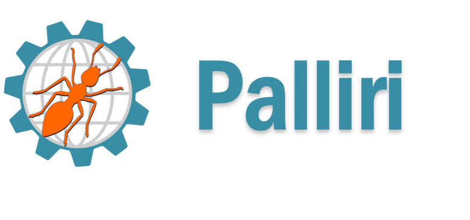
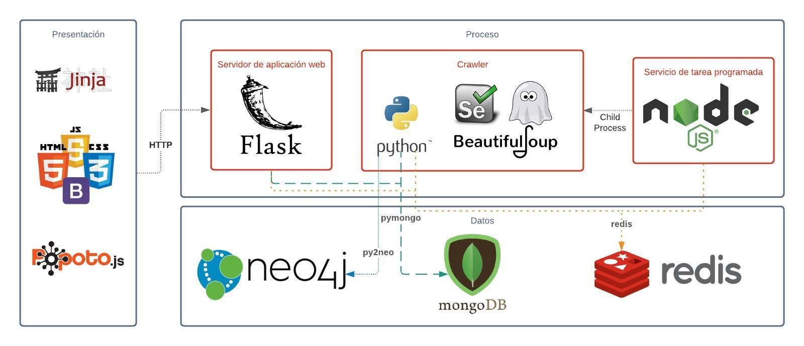

# En que consiste?

Es un proyecto que permite la extracción y visualización de información académica y laboral de funcionarios públicos en Colombia, a partir de 100 fuentes gubernamentales seleccionadas

# Componentes
* __Servidor de aplicaciones:__ Contiene y sirve la aplicación web usando el framework Flask.
  * Python: Submódulos para la consulta de información, codificación de los resultados y envío de emails.
  * PopotoJS: Librería de javascript que permite la consulta a Neo4j mediante la transformación de queries de grafo a Cypher y su respectiva visualización.
* __Almacenamiento:__ 
  * Redis: Contiene dos índices, uno que permite la identificación y clasificación de los sitios web y otro con los funcionarios públicos y su relación con la información extraída de los sitios.  
  * MongoDB: Contiene dos colecciones, en primera instancia la estructura o metadatos de cada una de las fuentes de información y por otra parte el contenido resultante de la extracción o versionamiento de las páginas.
  * Neo4j: Contiene la estructura tipo grafo de cada uno de los funcionarios hallados por el crawler con sus respectivas relaciones académicas y laborales.
* __Crawler:__
  * Python: Consta de los submódulos que permiten la inicialización con los metadatos de los sitios fuente, la extracción de los diferentes tipos de sitios web, la unificación de versiones y la reestructuración del JSON resultante del crawler a nodos y relaciones en Neo4j.
  * NodeJS: Permite la programación y ejecución de la tarea de explotación de los sitios web, a partir del índice de sitios web de Redis.
  
  
  
  # Demo
  El video donde se muestra la interacción con el aplicativo web se encuentra en el siguiente [enlace](https://www.youtube.com/watch?v=w-7JqM7wc6s)
